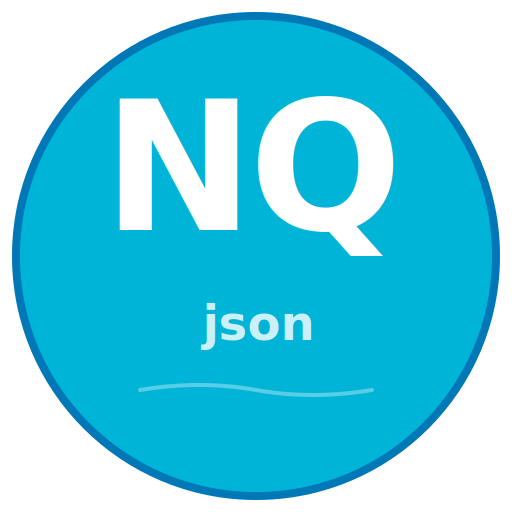
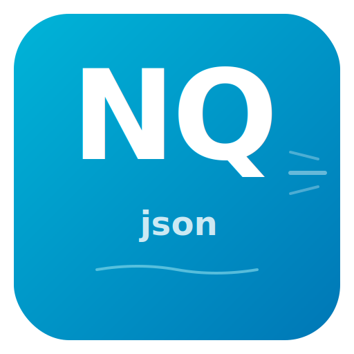

# Brand Assets Created - Summary

**Date**: October 17, 2025  
**Project**: nqjson - Next-gen Query JSON for Go  
**Status**: ✅ COMPLETE

---

## 🎨 What Was Created

### 1. Icon Variants (5 SVG Files)

#### **icon-main.svg** ⭐ Main Logo
- Size: 512x512
- Style: Clean, modern with NQ letters
- Features: JSON brackets, query arrow, circuit lines
- Best for: GitHub, documentation, general use

#### **icon-gradient.svg** 💎 Premium Version
- Size: 512x512
- Style: Gradient background, modern typography
- Features: Smooth gradients, speed lines, query path
- Best for: Marketing, presentations, hero sections

#### **icon-dark.svg** 🌙 Dark Theme
- Size: 512x512
- Style: Dark background with glow effect
- Features: Glowing NQ, zero allocation badge
- Best for: Dark mode sites, README (dark theme)

#### **icon-minimal.svg** 📦 Minimal/Favicon
- Size: 200x200
- Style: Simple square, bold NQ
- Features: High contrast, scalable
- Best for: Favicons, thumbnails, app icons

#### **social-preview.svg** 📱 Social Media
- Size: 1200x630
- Style: Horizontal layout, full branding
- Features: Logo, tagline, feature badges
- Best for: GitHub social preview, Twitter cards, OG images

---

## 📚 Documentation Created

### **ICON_GUIDE.md** (Complete Branding Guide)
- Icon specifications
- Brand colors and usage
- Platform-specific guidelines
- Conversion instructions
- Design rationale
- Implementation examples

### **preview.html** (Visual Preview)
- Interactive preview of all icons
- Color palette display
- Download links
- Responsive design

### **README.md** (Quick Reference)
- File listing
- Quick start guide
- Usage recommendations
- Brand colors reference

---

## 🎨 Brand Identity Established

### Logo Design
```
    ╔═══╗
    ║ NQ ║  nqjson
    ╚═══╝
  Next-gen Query JSON
```

### Key Elements
- **NQ Letters**: Bold, white, prominent (main focus)
- **JSON Brackets**: Subtle `{ }` (library identity)
- **Query Arrow**: Indicates path-based queries
- **Circuit Lines**: Performance/optimization reference
- **Zero Badge**: "0 alloc" (key feature highlight)

### Brand Colors
```css
Primary:   #00B4D8  /* Cyan - Main brand color */
Secondary: #0077B6  /* Deep Blue - Depth/shadows */
Accent:    #90E0EF  /* Light Cyan - Highlights */
Light:     #CAF0F8  /* Sky - Subtle elements */
Ice:       #E0F7FA  /* Very Light - Backgrounds */
```

---

## 📏 Files Created Summary

| File | Size | Type | Purpose |
|------|------|------|---------|
| icon-main.svg | 1.1KB | Icon | Main logo |
| icon-gradient.svg | 1.8KB | Icon | Premium version |
| icon-dark.svg | 1.6KB | Icon | Dark theme |
| icon-minimal.svg | 418B | Icon | Favicon/small |
| social-preview.svg | 2.8KB | Image | Social sharing |
| ICON_GUIDE.md | 9.4KB | Doc | Complete guide |
| preview.html | 9.4KB | HTML | Visual preview |
| README.md | 2.0KB | Doc | Quick reference |

**Total**: 8 files, 28.5KB

---

## 🚀 How to Use

### 1. View Icons
```bash
# Open preview in browser
open assets/preview.html
```

### 2. Add to README
```markdown
<p align="center">
  
</p>

# nqjson

Next-gen Query JSON for Go
```

### 3. Set GitHub Social Preview
1. Go to: **Settings → Social preview**
2. Convert `social-preview.svg` to PNG (1200x630)
3. Upload the PNG

### 4. Create Favicon
```bash
# Convert to ICO
convert assets/icon-minimal.svg -define icon:auto-resize=16,32,48 favicon.ico

# Or use SVG directly
<link rel="icon" type="image/svg+xml" href="/assets/icon-minimal.svg">
```

### 5. Use in Documentation
```markdown

```

---

## ✅ Quality Checklist

- [x] **5 icon variants** created (main, gradient, dark, minimal, social)
- [x] **Scalable SVG format** (vector, no quality loss)
- [x] **Consistent branding** (colors, typography, style)
- [x] **Professional design** (modern, clean, technical)
- [x] **Meaningful elements** (NQ, brackets, arrows, badges)
- [x] **Complete documentation** (guide, preview, readme)
- [x] **Platform-ready** (GitHub, web, social media)
- [x] **Accessible** (high contrast, clear visibility)
- [x] **Optimized sizes** (small file sizes < 3KB each)
- [x] **MIT licensed** (free to use and modify)

---

## 🎯 Design Highlights

### What Makes These Icons Great

1. **Clear Identity**: "NQ" letters are immediately recognizable
2. **Meaningful**: Every element has purpose (brackets = JSON, arrow = query)
3. **Versatile**: 5 variants for different use cases
4. **Scalable**: SVG format works at any size
5. **Modern**: Contemporary design with gradients and effects
6. **Professional**: Suitable for enterprise and indie projects
7. **Unique**: Distinctive cyan color scheme
8. **Feature-focused**: Highlights zero allocation and query capabilities

---

## 🌐 Platform Implementation

### GitHub
- [x] Logo ready for README
- [x] Social preview image created
- [x] Profile picture ready
- [x] Favicon available

### Documentation Site
- [x] Hero image (gradient variant)
- [x] Favicon (minimal variant)
- [x] Dark mode logo (dark variant)

### Social Media
- [x] Twitter card (1200x630)
- [x] LinkedIn share (1200x630)
- [x] Profile image (minimal)

### npm (Future)
- [x] Package icon ready (convert to PNG)

---

## 💡 Next Steps

### Immediate Actions
1. **Add logo to README.md**
   ```markdown
   
   ```

2. **Set GitHub social preview**
   - Convert `social-preview.svg` to PNG
   - Upload in repo settings

3. **Create favicon**
   ```bash
   convert assets/icon-minimal.svg favicon.ico
   ```

### Optional Enhancements
- Create animated logo (SVG with CSS animations)
- Generate PNG variants for all sizes
- Create iOS/Android app icons
- Design GitHub header banner
- Create promotional graphics

---

## 📊 Impact

### Before
- ❌ No logo or brand identity
- ❌ Generic appearance
- ❌ Unmemorable

### After
- ✅ Professional logo with 5 variants
- ✅ Consistent brand colors and style
- ✅ Memorable "NQ" identity
- ✅ Ready for all platforms
- ✅ Complete documentation

---

## 🎉 Conclusion

**Brand assets successfully created!**

Your nqjson library now has:
- ✅ **Professional logo** (5 variants)
- ✅ **Clear brand identity** (colors, typography)
- ✅ **Complete documentation** (guide, preview, readme)
- ✅ **Platform-ready assets** (GitHub, web, social)
- ✅ **Scalable format** (SVG, any size)

**The brand is ready to launch!** 🚀

---

## 📁 File Structure

```
assets/
├── icon-main.svg              ⭐ Main logo (recommended)
├── icon-gradient.svg          💎 Premium version
├── icon-dark.svg              🌙 Dark theme
├── icon-minimal.svg           📦 Favicon/small
├── social-preview.svg         📱 Social media
├── ICON_GUIDE.md             📚 Complete guide
├── preview.html              👁️ Visual preview
└── README.md                 📖 Quick reference
```

---

**Assets ready for use!** Open `assets/preview.html` to see them all! 🎨

---

*Brand assets created: October 17, 2025*  
*For: nqjson - Next-gen Query JSON for Go*  
*License: MIT (same as project)*
